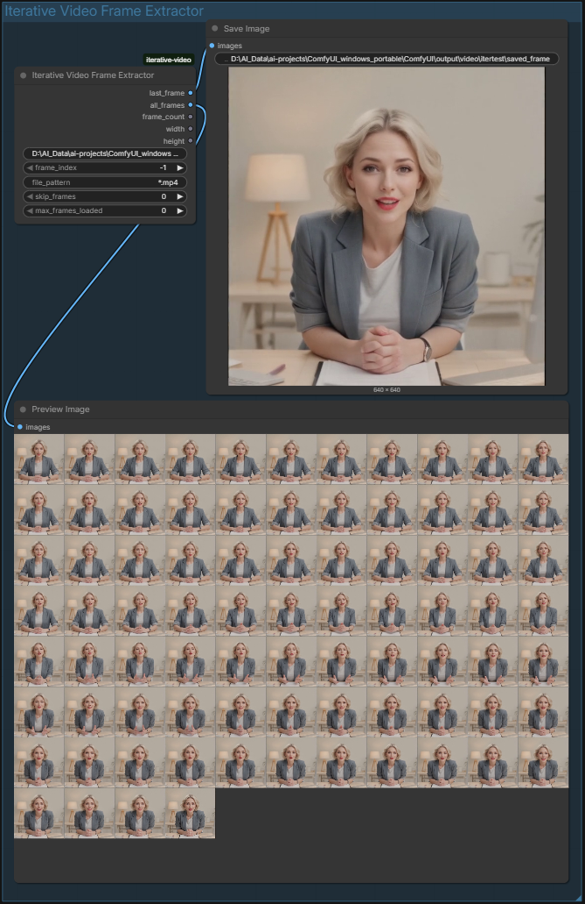

# Iterative Video

Custom nodes for **iterative video generation** workflows in ComfyUI. Extract frames from a previous iteration's video and feed the last frame back as a reference image for the next generation pass.



## Nodes

### Iterative Video Frame Extractor

Loads a video file (or auto-selects the newest video in a directory), decodes its frames, and outputs the last frame as a reference image for the next iteration of video generation.

**Outputs:**

| Output | Type | Description |
|---|---|---|
| `last_frame` | IMAGE | The selected reference frame (default: last frame) |
| `all_frames` | IMAGE | Every decoded frame as a batched IMAGE tensor |
| `frame_count` | INT | Total number of frames loaded |
| `width` | INT | Video width in pixels |
| `height` | INT | Video height in pixels |

**Inputs:**

| Input | Type | Default | Description |
|---|---|---|---|
| `video_path` | STRING | `""` | Absolute path to a video file **or** a directory (auto-selects newest file) |
| `frame_index` | INT | `-1` | Which frame to return as `last_frame`. `-1` = final frame |
| `file_pattern` | STRING | `*.mp4` | Glob pattern when `video_path` is a directory |
| `skip_frames` | INT | `0` | Trim N frames from the end (useful if final frames are black/corrupt) |
| `max_frames_loaded` | INT | `0` | Cap memory usage by only loading the last N frames. `0` = all |

### Iterative Video Path Builder

Utility node that constructs numbered file paths for iteration loops:

```
iteration 0  →  iter_video_00000.mp4
iteration 1  →  iter_video_00001.mp4
...
```

**Outputs:** `current_video_path`, `next_video_path`, and `next_iteration`.

> **Note:** The Path Builder is optional. For most workflows, pointing the Frame Extractor at your output directory with auto-select is simpler and requires no manual counter management. The Path Builder is mainly useful when both generation and extraction live in a single workflow with wired path connections.

## Installation

1. Copy the `iterative-video` folder into your ComfyUI `custom_nodes` directory:

```
ComfyUI/
  custom_nodes/
    iterative-video/
      __init__.py
      nodes.py
      requirements.txt
      README.md
```

2. Install dependencies using your ComfyUI Python. For standalone/portable builds:

```bash
.\python_embeded\python.exe -s -m pip install -r ComfyUI\custom_nodes\iterative-video\requirements.txt
```

For standard installs:

```bash
pip install -r ComfyUI/custom_nodes/iterative-video/requirements.txt
```

> `torch` and `numpy` are already included with ComfyUI — the only package that may need installing is `opencv-python`.

3. Restart ComfyUI. The nodes will appear under the **video/iterative** category.

## Usage

### Recommended Setup: Directory Auto-Select

The simplest approach is to point the Frame Extractor at your video output directory and let it auto-select the most recently modified file:

1. Set `video_path` to the **absolute path** of your output folder, e.g.:
   ```
   D:\AI_Data\ai-projects\ComfyUI_windows_portable\ComfyUI\output\video\itertest
   ```
2. Set `file_pattern` to `*.mp4` (or whatever format your video save node produces)
3. Leave `frame_index` at `-1` to grab the last frame

Each time you queue the workflow, the node picks up the newest video in that folder automatically.

> **Important:** Use absolute paths. Relative paths resolve from ComfyUI's working directory, which may not be where you expect.

### Iterative Video Loop

The basic loop for iterative video continuation:

1. **Generate** a video from your initial image/prompt using your preferred model (Wan, AnimateDiff, SVD, etc.)
2. **Queue the extractor workflow** — the Frame Extractor grabs the last frame from the video you just generated
3. **Feed `last_frame`** into your i2v model's reference/init image input
4. **Generate the next video** — it continues from where the previous one left off
5. **Repeat** as many times as needed

### Tips

- **`skip_frames`** — Some video generators produce black or corrupted trailing frames. Set this to trim them before selecting the reference frame.
- **`max_frames_loaded`** — Set to `1` if you only need the last frame. The node will seek directly to the end of the video instead of loading every frame into memory.
- **`all_frames`** — Standard batched IMAGE tensor. Pipe it into Preview Image, or any node that accepts image batches for inspection.
- **Drift mitigation** — After several iterations, outputs tend to degrade (color shift, loss of detail). Keep generation lengths short (2-4 seconds per clip) and use consistent prompts across iterations.
